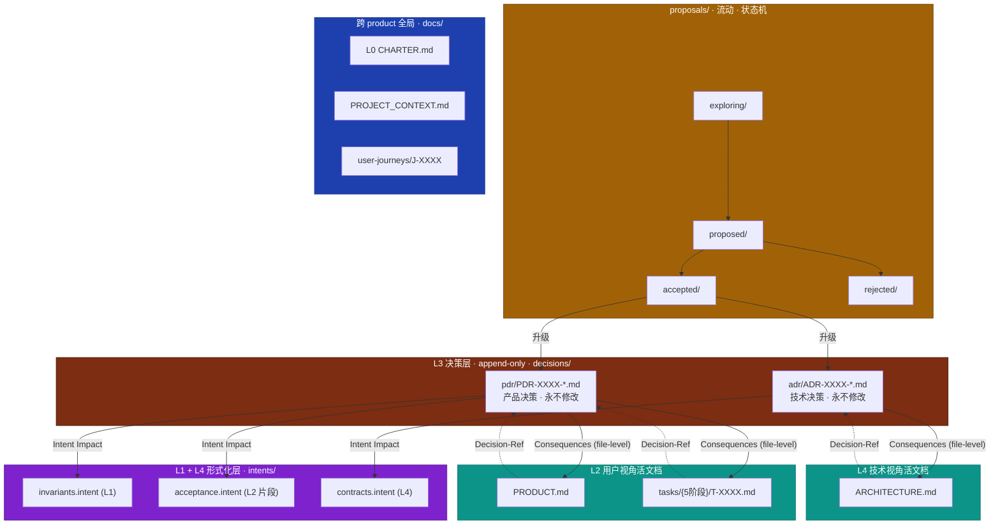
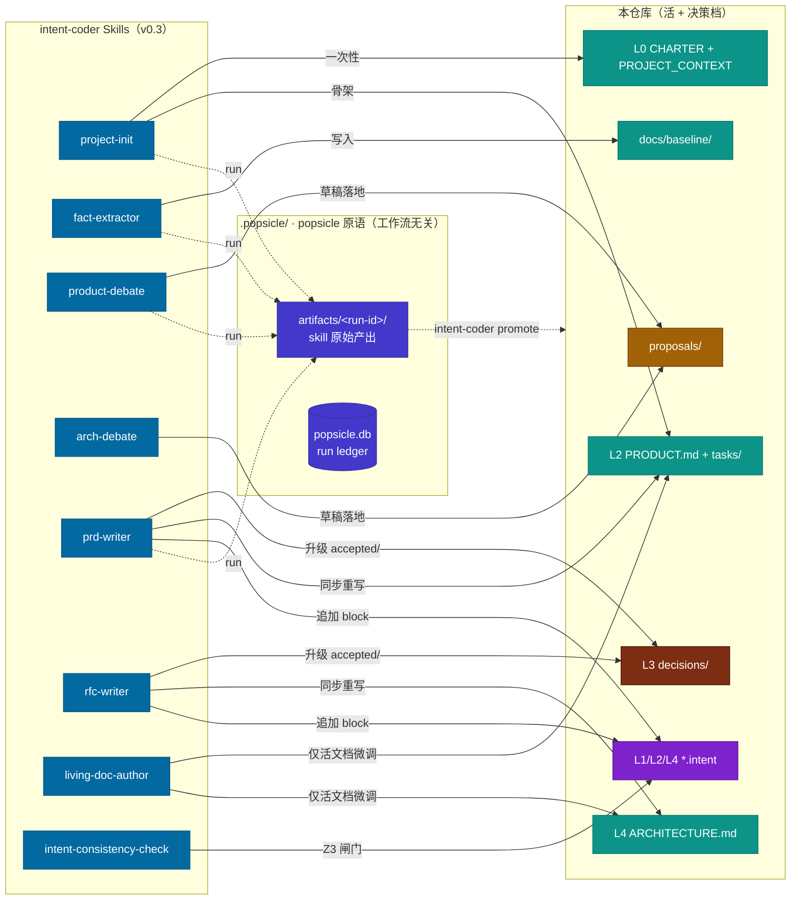

# Doc Architecture Charter — saas-demo

> **Status**: 基础性——修改本 charter 需要它自己的 CADR（Charter Amendment Decision Record）
> **Last-Updated**: 2026-05-13
> **Last-Decision-Ref**: project-init bootstrap（无 PDR，charter 由 init 直接落地）

本 charter 定义本仓库**文档如何组织、如何编写、如何变更**的不可妥协规则。每个
贡献者——人或 AI agent——在动 `docs/`、`products/*/PRODUCT.md`、
`products/*/ARCHITECTURE.md` 或任何决策文件之前，都要先读这份。

---

## 文档体系的四条铁律

1. **活文档没有版本号** —— 只有 `Last-Updated` 和 `Last-Decision-Ref`。它们永
   远代表「现在」。过期内容就地修正；不写历史叙事。
2. **决策档案只追加** —— ADR/PDR 文件在 `Status: Accepted` 之后永不修改。错的
   决策通过写一份**新**决策（标注 Supersedes）来纠正。
3. **每次活文档编辑必须引用一个 Decision ID**（除错别字 / 链接 / 措辞修复外）。
   改 `PRODUCT.md` / `ARCHITECTURE.md` / `tasks/*.md` 的 PR 由 CI 强制。
4. **一次变更可能波及多份活文档** —— 触发它的 ADR/PDR 的 `Consequences` 章节
   **必须**列出所有被它强制更新的活文档段落；PR 必须在一次提交里全部更新。

---

## Layer Map

文档体系分 7 层，由**它们约束什么**和**多久变一次**来区分。

| Layer | 文档 | 约束对象 | 变更频率 | Owner | intent-lang |
|---|---|---|---|---|---|
| L0 | `docs/CHARTER.md` | 产品存在的理由；绝对底线 | 一年级 | 创始人 / 架构委员会 | 仅自然语言 |
| L1 | `docs/invariants/*.intent`, `products/*/intents/invariants.intent` | 领域自然律 | 一季度 | PM + 架构师 | ✅ 核心 |
| L2 | `products/*/PRODUCT.md` + `tasks/**/*.md` + `acceptance.intent` | 用户可见行为 | 一月 | PM | ✅ acceptance 片段 |
| L3 | `products/*/decisions/{adr,pdr}/*.md` | 为什么这么选 | 决策时定，永不修改 | 架构师 / PM | ❌ |
| L4 | `products/*/ARCHITECTURE.md` + `contracts.intent` | 模块如何实现 | 提案期可变，落地即冻结 | 技术 lead | ✅ contracts 片段 |
| L5 | `migration/slices/*.md`、变更 PR | 一次具体变更 | 一次性 | 开发者 | ✅ 以 diff 形式 |
| L6 | `crates/`、`src/`、`tests/` | 机器行为 | 持续 | AI + 人 | — |

> **L2 在 v0.3 任务图范式下的展开**：旧版 L2 = 单一 PRODUCT.md 文件。v0.3 起
> L2 = PRODUCT.md（顶层索引）+ tasks/ 子目录（按 5 个旅程阶段分类的 task chunk）。
> 名义上仍是「PRODUCT.md 4 件套」，技术上是「顶层 + 多文件展开」。

### 写入流（PDR/ADR 如何驱动活文档变更）

下图显示一条决策从「草稿」到「生效」必须经过的传播路径，以及活文档 ↔ 决策档
之间的双向链。



**读图三规则**

1. 实线 = 写入流（PDR/ADR Accepted 触发下游修改）
2. 虚线 = 反向引用（活文档每段尾部的 `Decision-Ref` 锚点）
3. 配色：🟢 活 / 🟫 永生 / 🟡 流动 / 🔵 全局 / 🟣 形式化

### Skill ↔ 文档层映射

popsicle 本身**不携带工作流**——它只提供 Skill Runner、Run、Artifact 三个原语。
下图显示 intent-coder 的 skill 集合如何把 popsicle 的 artifact 区映射到本仓库的
L0–L4 文档层。`promote` 步骤由 intent-coder 自己实现（不污染 popsicle 核心）。



**关键边界**：popsicle 核心**不知道** L0–L6、PDR、ADR、proposals 这些概念。
所有「artifact → 仓库哪一层」的映射，是 intent-coder 模块自己实现的 promote
逻辑，通过读 popsicle 暴露的 `artifact_path(run_id, doc_id)` 接口完成。

---

## Per-Product 4-Piece Set

每一个 product（在 `products/<name>/` 之下）正好有 4 类制品：

| 制品 | 视角 | Audience | 更新方式 | 不准在这里写什么 |
|---|---|---|---|---|
| `PRODUCT.md` + `tasks/**/*.md` | 商业 + 用户旅程 | PM、销售、客户成功、AI Copilot | 直接编辑（小改）或 PDR 触发（大改）| 实现细节、技术选型理由 |
| `ARCHITECTURE.md` | 实现 | 工程师、AI | 直接编辑（小改）或 ADR 触发（大改）| 商业策略、定价、客户分层 |
| `intents/*.intent` | 形式化 | LLM、Z3、CI | 跟随 PRODUCT.md / ARCHITECTURE.md 的变化 | 自然语言叙述、理由（这些放进 PDR/ADR）|
| `decisions/{adr,pdr}/*` | 历史 | 任何追溯决策的人 | 只追加 | "当前状态"描述（放活文档里）|

---

## 三层 Intent 体系

| 作用域 | 路径 | Owner | 触发 |
|---|---|---|---|
| **跨 product（全局）** | `docs/invariants/*.intent` | charter 级别的决定 | "宪法级" PDR（罕见）|
| **单个 product** | `products/<name>/intents/invariants.intent` | product team | product 内部的 PDR |
| **单个 feature / acceptance** | `products/<name>/intents/acceptance.intent` | product team | product 内部的 PDR |
| **单个 contract / 模块 API** | `products/<name>/intents/contracts.intent` | 架构师 | product 内部的 ADR |

> 规则：每份 PDR/ADR 的 `Intent Impact` 章节必须指出它修改的是哪一层 intent。
> CI 拒绝缺这一项的决策。

---

## 提案 & 决策生命周期

### 技术侧（RFC → ADR）

```
┌─────────┐    accept    ┌──────────┐
│Proposed │ ───────────► │ Accepted │ （不可变）
└─────────┘              └────┬─────┘
     │                        │ supersede
     │ reject                 ▼
     ▼                   ┌─────────────┐
┌──────────┐             │ Superseded  │
│ Rejected │             └─────────────┘
└──────────┘
```

### Product 侧（PRFC → PDR）

```
┌──────────┐  ready   ┌──────────┐  accept  ┌──────────┐
│Exploring │ ───────► │Proposed  │ ───────► │ Accepted │
└──────────┘          └──────────┘          └────┬─────┘
     │ deadline             │                    │ supersede
     │ exceeded             │ reject             ▼
     ▼                      ▼              ┌─────────────┐
┌──────────┐          ┌──────────┐         │ Superseded  │
│ Rejected │          │ Rejected │         └─────────────┘
└──────────┘          └──────────┘
```

---

## 活文档中的禁用短语

如果某份活文档（`PRODUCT.md`、`ARCHITECTURE.md`、`tasks/*.md`）含有以下任一短
语，PR 评审不通过：

- "We originally used X..."
- "Previously, ..."
- "曾经..." / "之前..."
- "We migrated from X to Y because..."
- "Was: X. Now: Y."
- "将会..." / "上线后..." / "未来计划..."

这些短语描述**历史**或**未来**，而历史是 ADR / PDR / `git log` 的活、未来是
`proposals/exploring/` 的活。活文档**只用现在时**。

✅ `"Email/Password + 必选 2FA + Google OAuth 选项 [PDR-0001]"`
❌ `"初版用魔法链接登录，后改为 Email/Password 因为用户反馈"`
❌ `"上线后用户将能用 Google 登录"`

---

## v0.3 任务图范式：5 个固定旅程阶段目录

每个 product 的 `tasks/` 目录**固定 5 个**子目录，不允许增减（增减需要 CADR）：

| 目录 | 触发条件 | 完成条件 |
|---|---|---|
| `onboarding/` | 首次接触某能力 | 首次成功使用 |
| `daily-ops/` | 已掌握后的日常使用 | 满足具体业务需求 |
| `troubleshooting/` | 操作异常 / 失败 | 异常解除 |
| `admin/` | 组织 / 配额 / 权限 / 审计 | 管理操作生效 |
| `lifecycle/` | 终止 / 迁出 / 续费 / 归档 | 用户与产品某段关系结束 |

详细判定准则见 intent-coder 主仓库
[`skills/prd-writer/references/task-organization.md`](../../../skills/prd-writer/references/task-organization.md)。

---

## 反模式（以及如何检测）

| 反模式 | 检测方式 | 缓解 |
|---|---|---|
| **活文档当 wiki** —— 任何人都加章节 | PR 改活文档时做模板符合性检查 | 每份活文档固定大纲；加新章节需要 charter 修订 |
| **ADR/PDR 当日记** —— 日常 standup 笔记被记成决策 | 评审者问「这件事一年后还重要吗」 | `decisions/` PR 需要 2 个评审者 |
| **按 feature 模块给 task 归类** —— `tasks/user-management/` | 检查 `tasks/` 下是否只有 5 个标准目录 | 任务图只按用户旅程阶段分类 |
| **task 标题写功能名** —— `# 重置密码功能` | grep `^# .{1,8}功能$` / `^# 实现` | task 标题必须是完整用户原话句子 |
| **Roadmap 当愿望清单** —— 没 PDR 的想法 | grep `tasks/**` 找没有 Decision-Ref 的条目 | 没 Decision ID 的内容进 `proposals/exploring/` |
| **Doc–code drift** —— 活文档变陈旧 | CI 检查 `Last-Updated`；N 天后告警 | living-doc-author 重跑刷新 |

---

## Bootstrap 序列（已完成）

| 步骤 | 动作 | 状态 |
|---|---|---|
| 0 | 为每个 product 铺空的 4 件套骨架 + 5 个旅程目录 | ✅ 完成（project-init） |
| 1 | 首切片 (auth) 的 PDR + tasks 完整填充 | ✅ 完成 |
| 2 | billing 部分填充（演示跨 product 协调）| ✅ 完成 |
| 3 | admin-console 留 `[TBD]` 占位 | ✅ 完成（scaffold-only）|
| 4 | 跨 product 旅程 J-0001 落地 | ✅ 完成 |
| 5 | intent 层（acceptance / invariants / contracts）按 product 填充 | ✅ 部分完成（contracts 待 ADR）|

---

## Charter 自指

本 charter 本身就是一份活文档。修改它需要一类特殊的决策：**CADR**（Charter
Amendment Decision Record），位于 `docs/decisions/cadr/`。CADR 与其它决策文件
一样受四条铁律约束。

本 demo 暂无 CADR。
