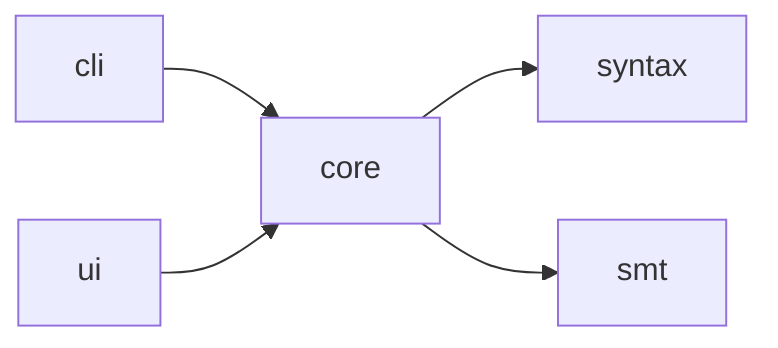

# Dependency Graph — {project_name}

> Companion to `{slug}.fact-extraction-report.md`. Records the project's module/crate/package import structure and external dependencies.

## Internal Module Graph

> Each row: which modules import which. Used by rfc-writer to design new module boundaries.

### Adjacency Table

| Module | Depends On (internal) | Reverse Deps |
|---|---|---|
| `intent-cli` | `intent-core` | (none — top of stack) |
| `intent-core` | `intent-syntax`, `z3` (external) | `intent-cli`, `intent-ui` |
| `intent-syntax` | (none) | `intent-core` |
| `intent-ui` | `intent-core`, `tauri` (external) | (none — top of stack) |

> Why two formats: the diagram is for humans skimming; the table is the machine-readable source of truth.

---

## External Dependencies

### Direct (declared in {Cargo.toml / package.json / go.mod})

| Name | Version | Used By | License | Notes |
|---|---|---|---|---|
| `serde` | `1.0.196` | `intent-core`, `intent-cli` | MIT/Apache | Serialization |
| `z3` | `0.12.1` | `intent-core` | MIT | SMT bindings |
| ... | ... | ... | ... | ... |

### Transitive (selected — full list in lockfile)

| Name | Version | Pulled In By | Notes |
|---|---|---|---|
| `libloading` | `0.8` | `z3 → z3-sys` | C library loader |
| ... | ... | ... | ... |

### Version Constraints

> Anything pinned, yanked, or under heavy churn. Helps adr-writer document upgrade decisions.

| Dependency | Current | Latest | Pin reason |
|---|---|---|---|
| `clap` | `4.5.0` | `4.5.27` | (none — ok to upgrade) |
| `tauri` | `=2.0.0` | `2.1.x` | Pinned: known regression in 2.1 (issue #X) |

---

## External Service Calls

> Network calls to external systems. Sourced from grep on common HTTP/gRPC client patterns.

| Service | Caller (file:line) | Protocol | Used For |
|---|---|---|---|
| {GitHub API} | `src/release/check.rs:42` | HTTPS | Version check |
| ... | ... | ... | ... |

---

## File-System Touch Points

> Where the project reads/writes outside its own working directory.

| Location | Purpose | Caller |
|---|---|---|
| `~/.config/{app}/` | User config | `src/config/load.rs:18` |
| `/tmp/{app}-*` | Scratch files | `src/cache/tmp.rs:5` |

---

## Extraction Checklist

- [ ] Internal graph + adjacency table both present
- [ ] External direct deps complete (no `…` in the table)
- [ ] Transitive deps section lists at least the security-sensitive ones (FFI, network, crypto)
- [ ] Version constraints section flags every pin/yank with a reason
- [ ] External service calls section either populated or explicitly says `(none — fully offline)`
- [ ] File-system touch points section either populated or explicitly says `(none)`
